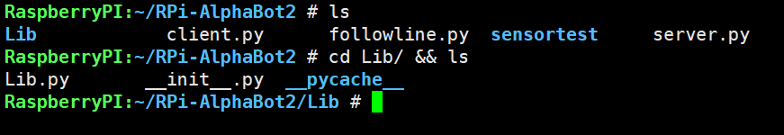
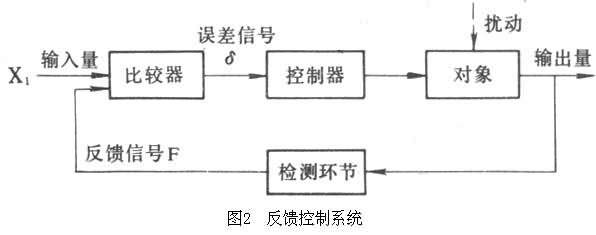
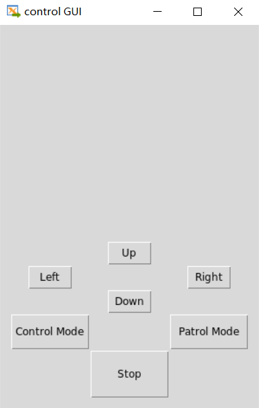

# Readme

## 0. 基本概述

小车的主控板为Raspberry Pi 3B，根据小车搭载的硬件，实现以下的基本功能：

- 能够顺着地上的黑色线条自动循迹
- 对于没有黑线的地方，通过Socket进行命令传输，从而控制运动，并可通过图形界面控制。
- 对于前方有障碍物，能够自动停止前进。

具体的设计部分如下：

## 1. 硬件驱动封装

### 1.1 以目录名作为模块

项目为了简化程序设计过程，提高程序的可维护性，控制程序规模，对底层硬件驱动进行了模块化。

在项目文件夹根目录下有一个名为`Lib`的文件夹，文件夹内有`Lib.py`和`__init__.py`文件。目录`Lib`就成为一个Python模块名，其下的`.py` 文件和目录则成为该模块的子模块。Python 这种构建模块的方法使得开发复杂功能的模块便得简单，模块也更容易维护。



### 1.2 传感与控制驱动

主要的硬件驱动包括：

- 红外传感器
- 超声波模块
- 蜂鸣器模块
- 电机模块

使用`class`关键字定义`Drive()`类，以类方法的形式编写上述驱动。伪代码结构形式如下：

```python
class Drive(object):
    def MHSensor_Init(self):
    def MHSensor(self):
    def Ultrasonic_Init(self):
    def Ultrasonic(self):
    def Buffer_Init(self):
    def Buffer_ON(self):
    def Buffer_OFF(self):
    def Motor_Init(self):
    def LMotorRun(self,speed):
    def RMotorRun(self,speed):
    def GoStraight(self):
    def GoBack(self):
    def Stop(self):
    def TurnLeft(self):
    def TurnRight(self):
```


### 1.2.1 红外传感器

红外传感器由一个红外发射管和一个红外接收管组成。作为循迹或避障应用时，发射管和接收管之间光隔离。发射管发出的红外光被反射后由接收管接收，再经过模数转换器得到量化的红外强度值。接收强度与传播距离和反射面对红外光的吸收性质有关。

```python
class Drive(object):

    #MH_Sensor Variable
    MH_CS = 5
    MH_CLOCK = 25
    MH_ADDRESS = 24
    MH_DATAOUT = 23

    def MHSensor_Init(self):
        GPIO.setup((self.MH_CS,self.MH_CLOCK, self.MH_ADDRESS),GPIO.OUT)
        GPIO.setup(self.MH_DATAOUT,GPIO.IN,GPIO.PUD_UP)

    def MHSensor(self):
        value = [0]*(6)
        #Read Channel0 ~ channel5 AD value
        for j in range (0,6):
            GPIO.output(self.MH_CS,GPIO.LOW)
            for i in range(0,10):
                #sent 4-bit Address
                if (i < 4):
                    bit = (((j) >> (3 - i)) & 0x01)
                    GPIO.output(self.MH_ADDRESS,bit)
                #read 10-bit data
                value[j] <<= 1
                value[j] |= GPIO.input(self.MH_DATAOUT)
                GPIO.output(self.MH_CLOCK,GPIO.HIGH)
                GPIO.output(self.MH_CLOCK,GPIO.LOW)

            GPIO.output(self.MH_CS,GPIO.HIGH)
            time.sleep(0.0001)
        for k in range (0,6):
            if (value[k] < 200):
                value[k] = 0
            else:
                value[k] = 1
        return value [1:]   # invalid address for channel 0

```

### 1.2.2 超声波模块

超声波测距模块工作时，要求在 $Trig$ 端口产生不短于$10\mu s$ 的正脉冲，模块会自动发出8 个周期的超声脉冲信号$(40kHz)$，并在 $Echo$ 端输出高电平。当检测到回波时将回置到低 $Echo$ 电平。通过测量 $Echo$ 高电平维持周期，再根据声波速度，就可以算出发射器到障碍物之间的距离。

```python
class Drive(object):
    
    #Ultrasonic
    TRIG = 22
    ECHO = 27

    def Ultrasonic_Init(self):
        GPIO.setup(self.TRIG,GPIO.OUT)
        GPIO.setup(self.ECHO,GPIO.IN)


    def Ultrasonic(self):
        GPIO.output(self.TRIG,GPIO.HIGH)
        time.sleep(0.000015)
        GPIO.output(self.TRIG,GPIO.LOW)

        GPIO.wait_for_edge(self.ECHO,GPIO.RISING)
        t1 = time.time()
        while GPIO.input(self.ECHO) == GPIO.HIGH:
            pass
        t2 = time.time()
        return (t2-t1)*34000/2

```

### 1.2.3 蜂鸣器模块

小车上带有一个蜂鸣器，项目中用作距离警报。

```python
class Drive(object):

    #Buffer Pin
    BUFFER_PIN = 4

    def Buffer_Init(self):
        GPIO.setup(self.BUFFER_PIN, GPIO.OUT)
    
    def Buffer_ON(self):
        GPIO.output(self.BUFFER_PIN, GPIO.HIGH)

    def Buffer_OFF(self):
        GPIO.output(self.BUFFER_PIN, GPIO.LOW)
```

### 1.2.4 电机模块

- 直流电机控制电路由两个功率输出端和一个控制开关组成。当控制开关接通时，输出电流方向由两个输入端的电压差决定，从而实现电机的双向转动控制。调整开关通、断时间比例即可调整电机转速，即控制端采用PWM方式调整转速。

- GPIO模块中，PWM需要设置两个参数：**频率**(单位:Hz) 和**占空比**(单位: 百分比)。

- 项目对电机的运动进行了封装，使用`LMotorRun(speed)`函数与`RMotorRun(speed)`函数对电机进行调速。但是这里的speed参数实际上是占空比（$\text{0%~100%}$）。所以要特别注意，这里的电机调速不是线性的，通俗的讲，就是不能做到均匀调速。
- Drive类还封装了小车前进、后退、原地左转、原地右转、停止的函数，便于后续的功能设计。


```python
class Drive(object):
   
    # PWMA-->P6 AIN1-->P12 AIN2-->P13
    # PWMB-->P26 BIN1-->P20 BIN2-->P21
    A1 = 12 
    A2 = 13
    CONTROLA = 6
    B1 = 20
    B2 = 21
    CONTROLB = 26

    def Motor_Init(self):
        GPIO.setup((self.A1,self.A2,self.CONTROLA),GPIO.OUT)
        GPIO.setup((self.B1,self.B2,self.CONTROLB),GPIO.OUT)
        self.pl = GPIO.PWM(self.CONTROLA,1000)
        self.pr = GPIO.PWM(self.CONTROLB,1000)
        self.pl.start(0)
        self.pr.start(0)

    def LMotorRun(self,speed):
        if speed >= 0:
            GPIO.output((self.A1,self.A2),(1,0))
            self.pl.ChangeDutyCycle(speed)
        else:
            GPIO.output((self.A1,self.A2),(0,1))
            self.pl.ChangeDutyCycle(-speed)
 
    def RMotorRun(self,speed):
        if speed >= 0:
            GPIO.output((self.B1,self.B2),(1,0))
            self.pr.ChangeDutyCycle(speed)
        else:
            GPIO.output((self.B1,self.B2),(0,1))
            self.pr.ChangeDutyCycle(-speed)

    def GoStraight(self):
        self.LMotorRun(15)
        self.RMotorRun(15)

    def GoBack(self):
        self.LMotorRun(-15)
        self.RMotorRun(-15)
 
    def Stop(self):
        self.LMotorRun(0)
        self.RMotorRun(0)
    
    def TurnLeft(self):
        self.LMotorRun(-15)
        self.RMotorRun(15)

    def TurnRight(self):
        self.LMotorRun(15)
        self.RMotorRun(-15)
```

## 2. 循迹实现

小车想要实现循迹功能，主要要解决两部分的问题，首先是传感，然后是控制。

### 2.1 传感

小车循迹主要依靠的传感器是红外传感器。小车沿着黑线运动时，由于地上的黑色线条会吸收红外线，会导致小车的五个红外传感器所探测到的反射光线的强度不一致，从而判断出小车与黑线的相对位置。进而对小车的运动进行控制，达到循迹的目的。

由第一部分完成的驱动模块化很容易实现红外传感器值的采集。

```python
mycar = Drive()
mycar.MHSensor_Init()
value = [0]*(6)
while 1:
    value = mycar.MHSensor()
```

### 2.2 运动控制

小车的运动运动控制采用的是负反馈。通俗地讲，就是小车向黑线右侧，就控制它朝左运动，小车向黑线左侧偏，就控制它朝右运动。下图是一个反馈控制系统的方框图：



控制器常用的是PID（比例、积分、微分）控制器，考虑到此处的模型比较简答，因此只采用P（比例）来控制。控制器的输入误差 $e(t)$ 和输出的控制信号 $u(t)$ 的关系为：$u\left( t \right) =K_p\cdot e\left( t \right) $

在本项目中，由于精度要求不是特别高，因此使用一个阈值对红外传感器的值进行检测，大于该阈值则为1表示该传感器检测到黑线，小于该阈值则为0，表示该传感器未检测到黑线。这样的话，输入误差$e(t)=1$，因此输出控制信号等于比例系数$u(t)=pp$。

```python
def pos_control(pp):
    if(value[1] == 1 and value[2] == 0):
        mycar.LMotorRun(-15-pp)
        mycar.RMotorRun(-15+pp)
    elif(value[1] == 0 and value[2] == 1):
        mycar.LMotorRun(-15+pp)
        mycar.RMotorRun(-15-pp)
    else:
        mycar.LMotorRun(-15)
        mycar.RMotorRun(-15)
 
    return
```

### 2.3 完整源程序

```python
#!/usr/bin/python3
# -*- coding:utf-8 -*-
from Lib.Lib import Drive
import time
import RPi.GPIO as GPIO

GPIO.setmode(GPIO.BCM)
mycar = Drive()
mycar.Motor_Init()
mycar.MHSensor_Init()
value = [0]*(6)
def pos_control(pp):
    if(value[1] == 1 and value[2] == 0):
        mycar.LMotorRun(-15-pp)
        mycar.RMotorRun(-15+pp)
    elif(value[1] == 0 and value[2] == 1):
        mycar.LMotorRun(-15+pp)
        mycar.RMotorRun(-15-pp)
    else:
        mycar.LMotorRun(-15)
        mycar.RMotorRun(-15)
 
    return
while 1:
    value = mycar.MHSensor()
    pos_control(10)

```


## 3. Socket网络通信控制

对于地面上没有黑线地方，小车使用**网络传输命令+Tkinter图形界面**的组合进行遥控。

### 3.1 Server端

#### 3.1.1 通过Socket接受命令

- Socket套接字的IP地址为127.0.0.1，端口为7777，建立TCP连接。

- 使用比较简单的通信命令格式

| 按钮         | 作用     | 命令 |
| ------------ | -------- | ---- |
| up           | 前进     | a    |
| down         | 后退     | b    |
| Left         | 原地左转 | c    |
| Right        | 原地右转 | d    |
| Control Mode | 控制模式 | 1    |
| Patrol Mode  | 循迹模式 | 2    |
| Stop         | 停止     | s    |

在本项目中，为了方便，C/S模型的两端都位于小车上。实际使用中，也可以根据需要，修改IP地址与端口进行真正意义上的远程控制，此时可能还需要额外的摄像头模块进行远程视频流传输。

#### 3.1.2 多线程函数执行距离警报

本项目使用threading模块对线程进行管理。具体步骤如下：

1. 定义子类`class Ultra_Thread(threading.Thread)`，继承`Thread `类
2. 重写`__init__()`方法
3. 重写`run()`，实现自己的线程入口
4. 实例化对象，并用`start()` 启动线程运行

该部分的作用是为了让超声波在另一个线程中执行测距任务，当距离小于阈值距离的时候，小车停下，蜂鸣器发出警报，避免撞到物体或墙。

#### 3.1.3 通讯协议解析与命令执行

用了非常简单的单字节通讯格式，在循环中不断接受Socket套接字接收到的字节，然后对字节命令进行判断，从而作出相应的前进、后退、原地左转、原地右转等动作。

#### 3.1.4 完整源程序

```python
#!/usr/bin/python3 
# -*- coding: utf-8 -*-
import socket
from Lib.Lib import Drive
import time
import RPi.GPIO as GPIO
import threading

GPIO.setmode(GPIO.BCM)
mycar = Drive()
mycar.Motor_Init()

class Ultra_Thread(threading.Thread):
    def __init__(self):
        super(Ultra_Thread, self).__init__()
    def run(self):
        myultra = Drive()
        myultra.Ultrasonic_Init()
        myultra.Buffer_Init()
        while True:
           dis = myultra.Ultrasonic();
           if dis < 10:
               myultra.Stop()
               myultra.Buffer_ON()
               sleep(1)
               myultra.Buffer_OFF()
        sleep(0.01)


t1 = Ultra_Thread()
t1.start()

s = socket.socket(socket.AF_INET, socket.SOCK_STREAM)
s.bind(('', 7777, ))
s.listen(5)
cli, addr = s.accept()
temp = 0
while True:
    if temp != '1':
        temp = cli.recv(1)
        temp = temp.decode()
    if temp:
        if temp == '1':
            while True:
                temp =cli.recv(1)
                temp = temp.decode()
                if temp:
                    if temp == 'a':
                        mycar.GoStraight()
                    elif temp == 'b':
                        mycar.GoBack()
                    elif temp == 'c':
                        mycar.TurnLeft()
                    elif temp == 'd':
                        mycar.TurnRight()
                    elif temp == 's':
                        mycar.Stop()
                    elif temp == '2':
                        mycar.Stop()
                        break
                    else:
                        mycar.Stop()
                    # print(temp)
                else:
                    mycar.Stop()
                    s.close()
                    break
        if temp == '2':
            while True:
                temp = cli.recv(1)
                temp = temp.decode()
                if temp:
                    if temp == '1':
                        break;

    else:
        mycar.Stop()
        s.close()
        break

```


### 3.2 Client端

#### 3.2.1 使用Tkinter构建GUI

原来本项目构想的是将图形窗口分为上下两部分，上部分显示实时视频图像，下部分显示控制按钮。但是由于时间仓促加上提供的树莓派开发板Linux系统经过了裁剪，无法使用官方文档上的指南，所以最终未实现图像传输，仅仅是完成了按钮控制部分。效果如下：



设计构想为：上、下、左、右四个方向控制键可在控制模式下使用。控制模式和循迹模式之间可以互相切换。还有一个紧急停止按钮。

#### 3.2.2 通过Socket发送命令

Socket套接字的IP地址为127.0.0.1，端口为7777，建立TCP连接。

使用了非常简单的通信格式：

|     按钮     |   作用   | 命令 |
| :----------: | :------: | :--: |
|      up      |   前进   |  a   |
|     down     |   后退   |  b   |
|     Left     | 原地左转 |  c   |
|    Right     | 原地右转 |  d   |
| Control Mode | 控制模式 |  1   |
| Patrol Mode  | 循迹模式 |  2   |
|     Stop     |   停止   |  s   |

#### 3.2.3 完整源程序

```python
#!/usr/bin/python3
import tkinter as tk
import socket

s = socket.socket(socket.AF_INET, socket.SOCK_STREAM)
# s.connect(('192.168.208.124', 9999))
s.connect(('127.0.0.1', 7777))

def Up():
    a = 'a'
    s.send(a.encode())

def Down():
    a = 'b'
    s.send(a.encode())

def Left():
    a = 'c'
    s.send(a.encode())

def Right():
    a = 'd'
    s.send(a.encode())

def Stop():
    a = 's'
    s.send(a.encode())

def CtrlMode():
    a = '1'
    s.send(a.encode())

def PatrolMode():
    a = '2'
    s.send(a.encode())

win = tk.Tk()
win.geometry('300x500') # width x height
win.title('control GUI')

f_control = tk.Frame(height = 250, width =300)
f_vedio = tk.Frame(height = 250, width=300)

button_up = tk.Button(f_control, text='Up', command=Up, width=3,height = 1)
button_down = tk.Button(f_control,text='Down', command=Down, width=3,height=1)
button_left = tk.Button(f_control, text='Left', command=Left, width=3,height=1)
button_right = tk.Button(f_control, text='Right', command=Right, width=3,height=1)
button_stop = tk.Button(f_control, text='Stop', command=Stop, width=8, height=3)
button_ctrl = tk.Button(f_control, text='Control Mode', command=CtrlMode, width=8, height=2)
button_patrol = tk.Button(f_control, text='Patrol Mode', command=PatrolMode, width=8, height=2)

f_control.grid(row = 1, column = 0)
f_vedio.grid(row = 0, column =0)
button_up.grid(row = 0, column = 2)
button_down.grid(row = 4, column = 2)
button_left.grid(row = 2, column = 0)
button_right.grid(row = 2, column = 4)
button_stop.grid(row = 8, column = 2)
button_ctrl.grid(row = 6, column = 0, sticky = tk.S)
button_patrol.grid(row = 6, column = 4, sticky = tk.S)


tk.mainloop()

```

